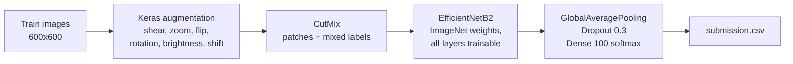
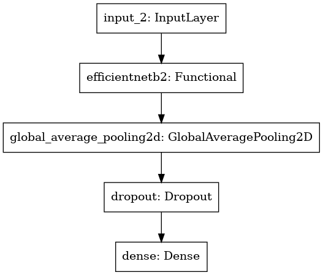

# Sorghum-100 Cultivar Identification (FGVC 9) - EfficientNetB2 + CutMix

Fine-grained image classification of 100 sorghum cultivars from field photos, built for the Kaggle competition
[Sorghum-100 Cultivar Identification - FGVC 9](https://www.kaggle.com/competitions/sorghum-id-fgvc-9) (CVPR 2022 FGVC workshop).
A fully fine-tuned, ImageNet-pretrained EfficientNetB2 trained with CutMix and a cyclical learning rate.

## Result

| Kaggle leaderboard | Accuracy |
| --- | --- |
| Public | **0.743** |
| Private | **0.73** |

Scores are the Kaggle leaderboard results of the submission produced by
[`KaggleSorghum100.ipynb`](KaggleSorghum100.ipynb) (competition metric: top-1 accuracy on the hidden test set),
as recorded in 2022. The notebook in this repository is committed without outputs.

## The task

The Sorghum-100 dataset is a labeled subset of the RGB imagery collected in the TERRA-REF field experiments in Arizona:
48,106 images of 100 sorghum cultivars, captured by a camera looking down on the plants over June 2017. The goal is to
predict the cultivar shown in each image.

What makes it hard is that it is *fine-grained*: images of different cultivars look almost the same, while images of the
same cultivar change a lot with the day, the time of day and the lighting. Sample images are shown on the
[competition page](https://www.kaggle.com/competitions/sorghum-id-fgvc-9/data).

## Approach



- **Transfer learning.** A convolutional network learns a hierarchy of image filters, from edges and textures up to
  object parts. Starting from filters learned on ImageNet and fine-tuning all of them on the ~22k sorghum training
  images converges faster and generalizes better than training from scratch. EfficientNetB2 was chosen as an
  accuracy/compute trade-off that still allows a high input resolution (600x600) for small leaf and panicle details.
- **Augmentation.** Standard geometric/photometric augmentation plus
  [CutMix](https://arxiv.org/abs/1905.04899) (via `cutmix-keras`): a random square patch from another image is pasted in,
  and the one-hot labels are mixed accordingly. It acts as a strong regularizer when classes are this similar.
- **Optimization.** Adam with a triangular cyclical learning rate (8e-5 to 4e-4, amplitude halved every cycle, from
  `tensorflow-addons`), categorical cross-entropy, batch size 15, up to 10 epochs, with a checkpoint on the best training
  loss and early stopping on training accuracy.



### Training log

Excerpt of the Keras log from the original run (first 8 of 10 epochs; later epochs were not recorded in this repo):

```text
Epoch 1/10  1480/1480 - 5461s - loss: 4.0380 - accuracy: 0.1098
Epoch 2/10  1480/1480 - 5140s - loss: 2.7756 - accuracy: 0.4004
Epoch 3/10  1480/1480 - 5140s - loss: 1.9511 - accuracy: 0.6333
Epoch 4/10  1480/1480 - 5119s - loss: 1.4336 - accuracy: 0.7557
Epoch 5/10  1480/1480 - 5136s - loss: 1.2705 - accuracy: 0.7837
Epoch 6/10  1480/1480 - 5135s - loss: 1.3065 - accuracy: 0.7738
Epoch 7/10  1480/1480 - 5157s - loss: 1.2264 - accuracy: 0.7862
Epoch 8/10  1480/1480 - 5132s - loss: 1.0509 - accuracy: 0.8149
```

These are **training** metrics on CutMix-augmented batches: no validation split was held out, so the ~0.81 accuracy
is not a generalization estimate. The only held-out numbers are the leaderboard scores above.

## Reproducing

The notebook was written for and run on **Kaggle Notebooks with a GPU**; there is no separate training script.

- **On Kaggle (recommended):** import `KaggleSorghum100.ipynb`, attach the competition data and the `small-jpegs-fgvc`
  dataset, enable a GPU and run all cells. Details in [`data/README.md`](data/README.md).
- **Locally:** requires a GPU and a TensorFlow version that still supports `tensorflow-addons` (<= 2.15):

  ```bash
  python -m venv .venv && source .venv/bin/activate
  pip install -r requirements.txt jupyter
  # download the data as described in data/README.md and set DATA_DIR in the notebook
  jupyter notebook KaggleSorghum100.ipynb
  ```

`requirements.txt` lists compatible version ranges; the exact package versions of the 2022 Kaggle image were not recorded.
Expect a long run: each epoch took about 1.4 hours in the original run.

## Repository structure

```text
.
├── KaggleSorghum100.ipynb   # full pipeline: data loading, augmentation, training, submission
├── data/README.md           # how to get the data and the expected folder layout
├── img/model.png            # Keras model graph
├── requirements.txt
└── LICENSE
```

## Next steps

- Hold out a stratified validation split (the `validation_split` option was left disabled to train on all data) so
  model selection and early stopping use a held-out metric instead of training accuracy.
- Replace `tensorflow-addons` (end-of-life) with a native Keras learning-rate schedule, and the deprecated
  `ImageDataGenerator` with a `tf.data` pipeline (faster input, compatible with Keras 3).
- Test-time augmentation and ensembling of several backbones/resolutions.
- Record per-epoch metrics and pin the exact environment for reproducibility.

## License

Code released under the [MIT License](LICENSE). The Sorghum-100 images and labels belong to the competition organizers
and are distributed by Kaggle under the competition rules; they are not included here.
